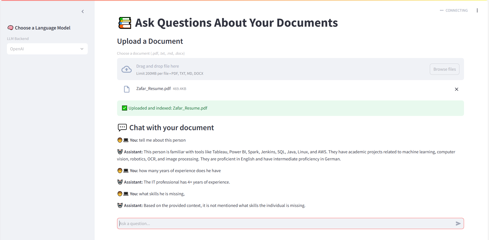

# 📄 RAG Document Search

A Retrieval-Augmented Generation (RAG) application built with **FastAPI**, **LangChain**, and **OpenAI**, supporting document ingestion, embedding, and intelligent Q&A over your own files.

## 🏗️ Architecture Overview

This project uses **both FastAPI and Streamlit**, serving different roles:

- **FastAPI** is the backend API framework that handles:
  - Document ingestion and indexing
  - Vectorstore management with FAISS
  - Exposing API endpoints (including Swagger UI at `/docs`)
  - Running the core logic for Retrieval-Augmented Generation (RAG)

- **Streamlit** provides a user-friendly frontend interface for interacting with the system:
  - Upload documents directly through the web UI
  - Ask questions and receive answers based on your documents
  - Display chat history and responses interactively


  
## 🖼️ App Interface




### Running the apps

- **Backend:** FastAPI runs the backend server, but **you don’t need to start it manually** if you’re using the Streamlit frontend, because the Streamlit app directly calls the shared application logic in Python without relying on the FastAPI server.

- **Frontend:** You only need to run the Streamlit app to use the full application UI and functionality:


🐳 Docker

🔧 Build the Image

docker-compose build --no-cache

▶️ Run the App

docker-compose up

Streamlit UI → http://localhost:8501

FastAPI backend → http://localhost:8000/docs


# Note
You need to create a .env file in the project root and add your OpenAI API key like this:
```bash
OPENAI_API_KEY=your_openai_api_key_here
```bash 

In app/main.py, ensure you load the environment variables and verify the key is set:

```bash
import os
from dotenv import load_dotenv

load_dotenv()

assert os.getenv("OPENAI_API_KEY"), "OPENAI_API_KEY is not set!"

```bash


# Run Locally

```bash
streamlit run streamlit_app.py


## ✨ Features

- 📄 Upload `.txt .pdf .md or docx` documents
- 🧠 Embed and index content using `LangChain` + `OpenAIEmbeddings`
- 📦 Vector search powered by `FAISS`
- 🤖 Ask questions and get intelligent, context-aware answers from your data
- ⚙️ CI/CD with GitHub Actions
- 🧪 Built-in linting, formatting, and testing

---

## 🧰 Tech Stack

- [FastAPI](https://fastapi.tiangolo.com/)
- [LangChain](https://www.langchain.com/)
- [FAISS](https://github.com/facebookresearch/faiss)
- [OpenAI API](https://platform.openai.com/)
- GitHub Actions for CI
- Pytest, Black, Isort, MyPy for testing and formatting

---

## 🛠️ Development Setup

### 📥 Clone the Repository

```bash
git clone https://github.com/SyedAliZafar/RAG_DOC_SEARCH.git
cd RAG_DOC_SEARCH


📁 Project Structure

RAG_DOC_SEARCH/
├── app/
│   ├── main.py
│   ├── ingestion.py
│   ├── rag_chain.py
├── .env
├── streamlit_app.py
├── uploaded_files/
├── tests/
├── requirements.txt
├── requirements-dev.txt
├── Dockerfile
├── docker-compose.yml
├── .github/workflows/ci.yml
├── images/
│   └── userinterface.PNG
└── README.md


📦 Install Dependencies
pip install -r requirements.txt
pip install -r requirements-dev.txt


🔑 Set Your OpenAI API Key
Either in your shell:

export OPENAI_API_KEY=your_key_here

Or by creating a .env file and loading it:

OPENAI_API_KEY=your_key_here

🧪 Run Locally
streamlit run streamlit_app.py

Open your browser and visit:
👉 http://localhost:8501 — for Steamlit App


🧊 .env Setup for Docker
Make sure your .env file is present in the root with:

OPENAI_API_KEY=your_key_here


🐍 Requirements
Python 3.9+

OpenAI API Key


🧪 Run Tests
pytest tests/


🧹 Formatting & Linting
Run all checks:

black --check app tests
isort --check-only app tests
flake8 app tests
mypy app

🔄 CI/CD
GitHub Actions runs automatically on every push to main and on pull requests. It performs:

✅ Code formatting check using black

✅ Static code analysis via flake8, isort, and mypy

✅ Unit testing using pytest

✅ Secure key handling through OPENAI_API_KEY stored in GitHub Secrets

✅ Streamlit-based frontend integrated alongside FastAPI

✅ Support for multiple file types, including .pdf, .txt, .md, .docx


## 📝 License

This project is licensed under the [MIT License](LICENSE).